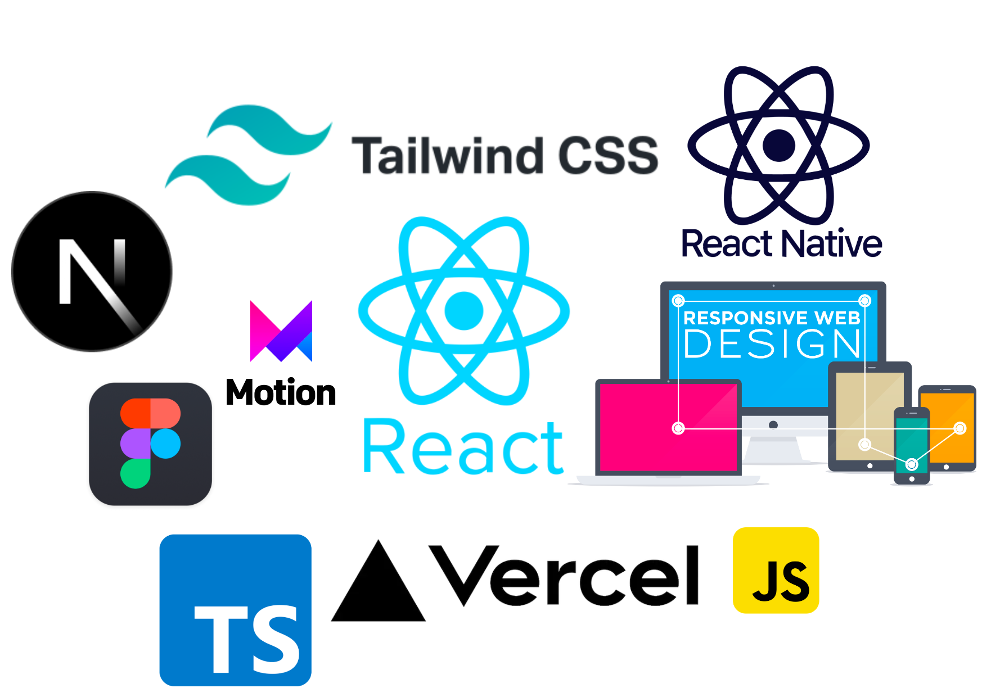

# Dashboard Videos BeMaster VideoTool Documentation

## Introduction

Welcome to the documentation for Dashboard Videos BeMaster VideoTool! This project is a basic web application built using React.js, TypeScript, Framer Motion for animations, Next.js 13 for server-side rendering, Tailwind CSS for styling, and is designed with responsive design principles. The primary purpose of this project is to provide a simple administration panel for managing videos.

This is a [Next.js](https://nextjs.org/) project bootstrapped with [`create-next-app`](https://github.com/vercel/next.js/tree/canary/packages/create-next-app).

## Getting Started

First, run the development server:

```bash
npm run dev
# or
yarn dev
# or
pnpm dev
# or
bun dev
```

Open [http://localhost:3000](http://localhost:3000) with your browser to see the result.
